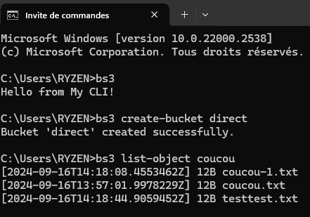

# Utilisation du CLI avec Cobra

## Build le projet pour générer un fichier `.exe`
```bash
go build -o bs3/bs3.exe
```

## Créer une commande avec le CLI Cobra
```bash
cobra-cli add "NOM DE COMMANDE"
```

## Exécuter une commande
```bash
go run main.go "NOM DE COMMANDE" "ARGS"
```
```bash
bs3/bs3.exe "NOM DE COMMANDE" "ARGS"
```

## Configurer le chemin vers son fichier de configuration 
```bash
$env:MYCLI_CONFIG = "config.yaml" 
```

## Pour utiliser le prefix "bs3" dans bash

Ajouter : `[chemin vers]\my-cli-s3\bs3` à la variable d'environnement `PATH` de Windows.




## Commandes disponibles

- **Créer un bucket** :  
  ```bash
  bs3 create-bucket <bucket-name>
  ```
- **Lister les buckets** :  
  ```bash
  bs3 list-buckets
  ```
- **Lister les objets** :  
  ```bash
  bs3 list-object <bucket-name>
  ```

- **Uploader un fichier** :  
  ```bash
  bs3 upload-file <bucket-name> <file-path>
  ```

- **Télécharger un fichier** :  
  ```bash
  bs3 download-file <bucket-name> <file-name> <destination-path>
  ```

- **Supprimer un bucket** :  
  ```bash
  bs3 delete-bucket <bucket-name> 
  ```

- **Supprimer un objet** :  
  ```bash
  bs3 delete-object <bucket-name> <object-name>
  ```

  ## Pour lancer les test 
  ```bash
  go test -count=1 -v ./cmd_test
  ```
